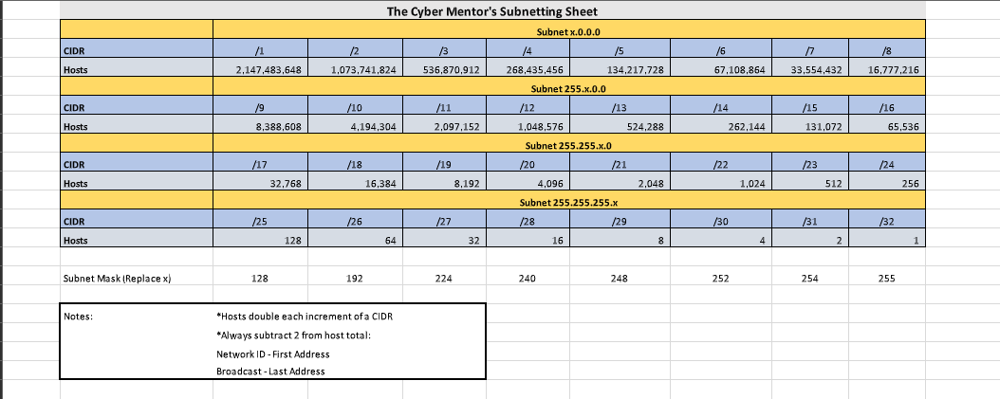

# Subnetting

`Website:` [https://www.ipaddressguide.com/](https://www.ipaddressguide.com/)

\_\_\_\_\_\_\_\_\_\_\_\_\_\_\_\_\_\_\_\_\_\_\_\_\_\_\_\_\_\_\_\_\_\_\_\_\_\_\_\_\_\_\_\_\_\_\_\_\_\_\_\_\_\_\_\_\_\_\_\_\_\_\_\_\_\_\_\_\_\_\_\_\_\_\_\_\_\_\_\_

TCM Subnetting Guide - [`Google Drive Link`](https://drive.google.com/file/d/1ETKH31-E7G-7ntEOlWGZcDZWuukmeHFe/view)\`\`



Out of 32-bit IPv4 address:

* Count the 1's & we get **`/x`** type notation, x=no of 1's
* Count the 0's & we get **`Total No of host = 2^x`**, where x=no of 0's
* **`Usable host = Total - 2`**
* Reamining 2 addresses are **: `Network ID` =** 1st address  **`Broadcast IP` =** last address  ****

